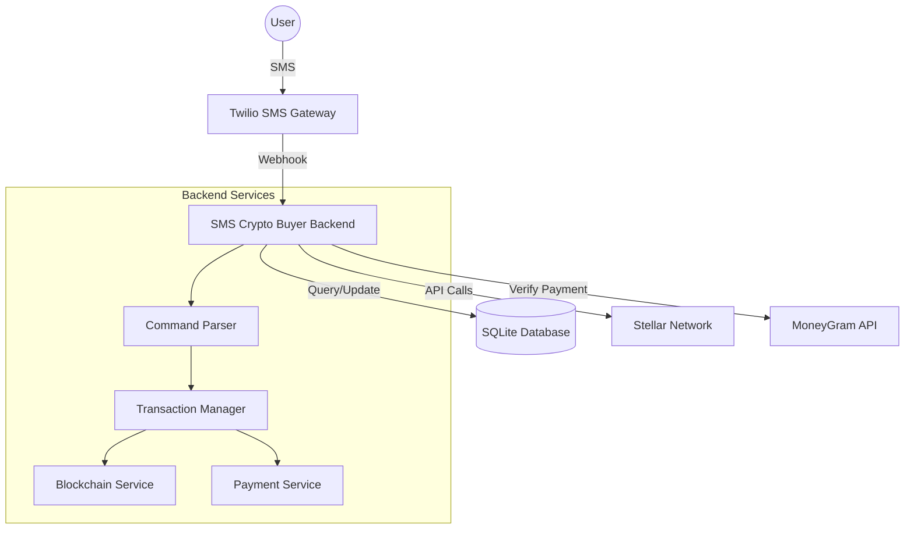
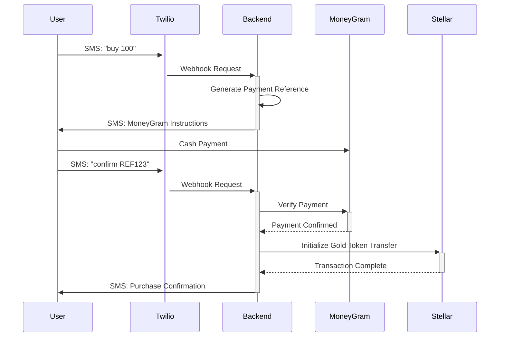
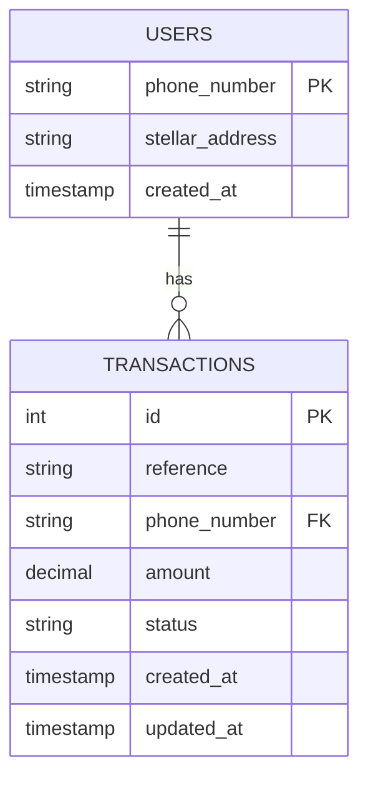

# GOLD-SMS

A prototype SMS-based application for purchasing Gold token cryptocurrency using MoneyGram cash point payments for the unbanked.

## Features

- Purchase Gold via SMS
- MoneyGram payment integration (simulated)
- Real-time balance checking
- Transaction history
- Stellar blockchain integration

## Setup

1. Install dependencies:
```bash
pip install -r requirements.txt
```

2. Create `.env` file using `.env.example`

3. Initialize the application:
```bash
python main.py
```

## SMS Commands

- `buy <amount>` - Start USDC purchase
- `confirm <reference>` - Confirm payment
- `balance` - Check Gold balance
- `history` - View transaction history
- `account` - View Account

## Technical Architecture

### System Overview
The system architecture diagram below shows how different components interact:



### Purchase Flow
The sequence diagram below illustrates the purchase flow from SMS initiation to completion:



### Database Schema
The entity relationship diagram shows the database structure:



## Testing

For local testing:
1. Install ngrok: https://ngrok.com/download
2. Run ngrok: `ngrok http 5000`
3. Update Twilio webhook URL with ngrok URL/sms

## Development Notes

- Currently using Stellar testnet
- MoneyGram integration is simulated
- All transactions are logged in SQLite database
